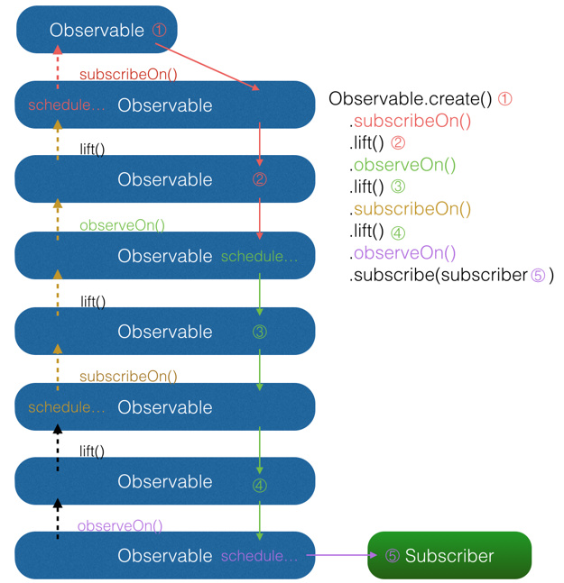

### RxJava 的线程控制使用与原理

> RxJava中的线程控制有两个方法

1. ```subscribeOn``` : 发生在通知流程(**如果对通知流程与发送流程不理解的请查看我的《"变换"深入理解》**)，指定的是当前```Observable.call()```方法以及之后所有操作的线程。(下面将会详细分析这一方法的作用)
2. ```observeOn``` : 发生在发送流程，指定的是当前```Subscriber.onNext()```方法以及之后的所有操作的线程。(同上)

此方法有一个单参数：

|调度器类型|效果|
|:--:|:--|
|Schedulers.computation()|用于计算任务，如事件循环或和回调处理，不要用于IO操作(IO操作请使用Schedulers.io())；默认线程数等于处理器的数量|
|Schedulers.from(executor)|使用指定的Executor作为调度器|
|Schedulers.immediate()|在当前线程立即开始执行任务|
|Schedulers.io()|用于IO密集型任务，如异步阻塞IO操作，这个调度器的线程池会根据需要增长；对于普通的计算任务，请使用Schedulers.computation()；Schedulers.io()默认是一个CachedThreadScheduler，很像一个有线程缓存的新线程调度器|
|Schedulers.newThread()|为每个任务创建一个新线程|
|Schedulers.trampoline()|当其它排队的任务完成后，在当前线程排队开始执行|

一个常见的线程控制的例子：

```java
Observable.just("hello"， "my"， "name"， "is"， "nichool")
               .map(new Func1<String， String>() {
                   @Override
                   public String call(String s) {
                      //在io线程中 执行
                       LogUtils.LogW("return " + " map: " + s + " " + Thread.currentThread().getName());
                       return " map: " + s;
                   }
               })
               .subscribeOn(Schedulers.io())
               .observeOn(AndroidSchedulers.mainThread())
               .subscribe(new Subscriber<String>() {
                   @Override
                   public void onStart() {
                       super.onStart();
                       //在主线程中执行
                       LogUtils.LogW(" onStart " + Thread.currentThread().getName());
                   }

                   @Override
                   public void onCompleted() {
                       //在主线程中执行
                       LogUtils.LogW(" onCompleted " + Thread.currentThread().getName());
                   }

                   @Override
                   public void onError(Throwable e) {
                       LogUtils.LogW(" onError " + Thread.currentThread().getName());
                   }

                   @Override
                   public void onNext(String s) {
                       //在主线程中执行
                       LogUtils.LogW(" onNext( " + s + " ) " + Thread.currentThread().getName());
                   }
               });
```

打印的Log:

```java
     RxJavaDemo:  onStart main
     RxJavaDemo: return  map: hello RxIoScheduler-2
     RxJavaDemo: return  map: my RxIoScheduler-2
     RxJavaDemo:  onNext(  map: hello ) main
     RxJavaDemo: return  map: name RxIoScheduler-2
     RxJavaDemo:  onNext(  map: my ) main
     RxJavaDemo: return  map: is RxIoScheduler-2
     RxJavaDemo:  onNext(  map: name ) main
     RxJavaDemo: return  map: nichool RxIoScheduler-2
     RxJavaDemo:  onNext(  map: is ) main
     RxJavaDemo:  onNext(  map: nichool ) main
     RxJavaDemo:  onCompleted main
```

> 为了更好在使用以上两种方法来控制线程，我们就来分析下原理吧。

  在RxJava中所有的操作都是一次"变换" (关于"变换"的理解请查看我的《"变换"深入理解》)， 同样```subscribeOn```与```observeOn```也是一种"变换"。

  **废话不多说了，快请上我源码大人！！**

  1. subscribeOn 源码分析：

     ```java
      //Observable.java
      public final Observable<T> subscribeOn(Scheduler scheduler) {
           if (this instanceof ScalarSynchronousObservable) {
               return ((ScalarSynchronousObservable<T>)this).scalarScheduleOn(scheduler);
           }
           return create(new OperatorSubscribeOn<T>(this， scheduler));
       }

       //OperatorSubscribeOn.java
       @Override
       public void call(final Subscriber<? super T> subscriber) {
           final Worker inner = scheduler.createWorker();
           subscriber.add(inner);

           inner.schedule(new Action0() {
               @Override
               public void call() {
                   final Thread t = Thread.currentThread();

                   Subscriber<T> s = new Subscriber<T>(subscriber) {
                       @Override
                       public void onNext(T t) {
                           subscriber.onNext(t);
                       }

                       @Override
                       public void onError(Throwable e) {
                           try {
                               subscriber.onError(e);
                           } finally {
                               inner.unsubscribe();
                           }
                       }

                       @Override
                       public void onCompleted() {
                           try {
                               subscriber.onCompleted();
                           } finally {
                               inner.unsubscribe();
                           }
                       }

                       ...
                   };

                   source.unsafeSubscribe(s);
               }
           });
       }

       //Observable.java
       public final Subscription unsafeSubscribe(Subscriber<? super T> subscriber) {
            try {
                // new Subscriber so onStart it
                subscriber.onStart();
                // allow the hook to intercept and/or decorate
                hook.onSubscribeStart(this， onSubscribe).call(subscriber);
                return hook.onSubscribeReturn(subscriber);
            } catch (Throwable e) {
                ...
            }
        }
     ```

   通过上面的源码我们得知流程如下：
   ```subscribeOn``` 通过```Create(new OperatorSubscribeOn<T>(this， scheduler))```方法创建一个新的```Observable```，这个新的```Observable```的```call```方法中，通过指定的```Scheduler```开启任务，任务中创建一个新的```Subscriber```，然后通知父```Observable```来处理```Subscriber```。

   总结 ：
    ```subscribeOn```方法创建了一个新的```Observable```（被观察者），当这个新的```Observable```被通知的时候，在指定线程中执行后面的操作（封装```subscriber```，通知父```Observable```）。**其实分析到这里也就解释了```subscribeOn```就是一种"变换"，只不过具体操作不一样**

   上面源码中有这么一段逻辑，作者我查看ScalarSynchronousObservable源码得知只有在Observable.just(T t).subscribeOn()时会进入，这段逻辑内部也包含上面类似的逻辑，只不过加入了针对的处理。

```java
   if (this instanceof ScalarSynchronousObservable) {
       return ((ScalarSynchronousObservable<T>)this).scalarScheduleOn(scheduler);
   }
```

  2. observeOn 源码分析：

```java
  //Observable.java
  public final Observable<T> observeOn(Scheduler scheduler， boolean delayError， int bufferSize) {
        if (this instanceof ScalarSynchronousObservable) {
            return ((ScalarSynchronousObservable<T>)this).scalarScheduleOn(scheduler);
        }
        return lift(new OperatorObserveOn<T>(scheduler， delayError， bufferSize));
    }

  //OperatorObserveOn.java
  @Override
  public Subscriber<? super T> call(Subscriber<? super T> child) {
      if (scheduler instanceof ImmediateScheduler) {
          // avoid overhead， execute directly
          return child;
      } else if (scheduler instanceof TrampolineScheduler) {
          // avoid overhead， execute directly
          return child;
      } else {
          ObserveOnSubscriber<T> parent = new ObserveOnSubscriber<T>(scheduler， child， delayError， bufferSize);
          parent.init();
          return parent;
      }
  }

  //OperatorObserveOn$ObserveOnSubscriber.java
  @Override
  public void onNext(final T t) {
      if (isUnsubscribed() || finished) {
          return;
      }
      if (!queue.offer(on.next(t))) {
          onError(new MissingBackpressureException());
          return;
      }
      schedule();
  }

  @Override
  public void onCompleted() {
      if (isUnsubscribed() || finished) {
          return;
      }
      finished = true;
      schedule();
  }

  @Override
  public void onError(final Throwable e) {
      if (isUnsubscribed() || finished) {
          RxJavaPlugins.getInstance().getErrorHandler().handleError(e);
          return;
      }
      error = e;
      finished = true;
      schedule();
  }

  protected void schedule() {
      if (counter.getAndIncrement() == 0) {
          recursiveScheduler.schedule(this);
      }
  }

  // only execute this from schedule()
  @Override
  public void call() {
      //recursiveScheduler.schedule(this) 在这里执行
      ...
      final Subscriber<? super T> localChild = this.child;
      ...
      for (;;) {
          long requestAmount = requested.get();

          while (requestAmount != currentEmission) {
              boolean done = finished;
              Object v = q.poll();
              boolean empty = v == null;

              if (empty) {
                  break;
              }

              localChild.onNext(localOn.getValue(v));
              ...
          }
      }
  }
```

  通过上面的源码我们得知流程如下：
  ```observeOn``` 通过```lift(new OperatorObserveOn<T>())``` 创建一个新的```Observable```(```left()```不再赘述, 请查看我的《"变换"深入理解》），在```OperatorObserveOn.call```方法中当判断scheduler为当前线程则不予处理直接返回，其他情况则通过```ObserveOnSubscriber```来封装传入的```Subscriber```生成一个新的Subscriber。在新的Subscriber的实现中，都会调用```schedule()```方法来指定线程执行```Subscriber.onNext()``` (调用```this.call()```).

  > 总结 (**重点**)

  ```observeOn``` 和 ```subscribeOn``` 一样都是指定线程来完成后面的逻辑，**区别在于subscribeOn是作用在通知时```Observable.call()```，也就是它通知流程的后面逻辑（可能包括发送流程），observeOn是作用在发送时```Subscriber.onNext()```。也就是它的发送流程后面的逻辑。**

  综上所述可以合并成这样一张流程图 [下图来源]( https://gank.io/post/560e15be2dca930e00da1083#toc_15)：
  

  右边是对应的代码，左边流程图是具体的内部变化。不同颜色的线代表着在不同的线程中执行，向上是通知流程```Observable.call()```，向下是发送流程```Subscriber.next()```。**特别注意:请看红色的线，由于```subscribeOn```导致切换了线程，并且后面没有```observeOn```切换线程，所以第一个```left()```将在```subscribeOn```指定的线程中执行。**

  请大家结合上面的分析以及这个流程图好好理解下RxJava的线程控制。

  > 延展

  有这样一个常见的问题，请看下面的代码。

```java
new Thread() {
  @Override
  public void run() {
      super.run();
      Observable.just("hello"， "my"， "name"， "is"， "nichool")
              .map(new Func1<String， String>() {
                  @Override
                  public String call(String s) {
                      //io线程中执行
                      LogUtils.LogW("return " + " map: " + s + " " + Thread.currentThread().getName());
                      return " map: " + s;
                  }
              })
              .subscribeOn(Schedulers.io())
              .observeOn(AndroidSchedulers.mainThread())
              .subscribe(new Subscriber<String>() {
                  @Override
                  public void onStart() {
                      //new Thread 中执行
                      super.onStart();
                      LogUtils.LogW(" onStart " + Thread.currentThread().getName());
                  }

                  @Override
                  public void onCompleted() {
                      //主线程中执行
                      LogUtils.LogW(" onCompleted " + Thread.currentThread().getName());
                  }

                  @Override
                  public void onError(Throwable e) {
                      //主线程中执行
                      LogUtils.LogW(" onError " + Thread.currentThread().getName());
                  }

                  @Override
                  public void onNext(String s) {
                      //主线程中执行
                      LogUtils.LogW(" onNext( " + s + " ) " + Thread.currentThread().getName());
                  }
              });
  }
}.start();
```

  Log日志：

```java
RxJavaDemo: onStart Thread-8
RxJavaDemo: return  map: hello RxIoScheduler-2
...
RxJavaDemo:  onCompleted main
```

  可以看出上面的```onStart```是运行在当前线程上的(```onStart```是在```subscribe()```时就被调用的)，也就是不在主线程上的。如果我们需要在```onStart```中执行Android上UI的显示(比如进度条显示出来并且设置进度为0)，则直接会报错误。

  解决办法: 使用```doOnSubscribe```与```subscribeOn```的组合在通知流程中额外添加一个处理来代替onStart。

```java
new Thread() {
  @Override
  public void run() {
      super.run();
      Observable.just("hello"， "my"， "name"， "is"， "nichool")
              .subscribeOn(Schedulers.io())
              .doOnSubscribe(new Action0() {
                  @Override
                  public void call() {
                      //此处运行在主线程中 此处的call() 在Observable.call时就会调用。
                      LogUtils.LogW(" doOnSubscribe " + Thread.currentThread().getName());
                  }
              })
              .map(new Func1<String， String>() {
                  @Override
                  public String call(String s) {
                      //此处运行在IO线程中 此处的call()只有在发送流程时才会被调用。
                      LogUtils.LogW("return " + " map: " + s + " " + Thread.currentThread().getName());
                      return " map: " + s;
                  }
              })
              .subscribeOn(AndroidSchedulers.mainThread())
              .observeOn(AndroidSchedulers.mainThread())
              .subscribe(new Subscriber<String>() {
                  @Override
                  public void onStart() {
                      super.onStart();
                      LogUtils.LogW(" onStart " + Thread.currentThread().getName());
                  }

                  @Override
                  public void onCompleted() {
                      LogUtils.LogW(" onCompleted " + Thread.currentThread().getName());
                  }

                  @Override
                  public void onError(Throwable e) {
                      LogUtils.LogW(" onError " + Thread.currentThread().getName());
                  }

                  @Override
                  public void onNext(String s) {
                      LogUtils.LogW(" onNext( " + s + " ) " + Thread.currentThread().getName());
                  }
              });
        }
    }.start();
```
  原理 :
    1. ```doOnSubscribe```创建了一个```Observable```， 当执行通知流程时会调用这个```Observable.call()```方法，内部会调用这个重写的call方法.
    2. ```subscribeOn（AndroidSchedulers.mainThread()``` 与 ```subscribeOn(Schedulers.io())```使线程切换了两次，先是切换成AndroidSchedulers.mainThread()，然后执行完doOnSubscribe中的call()，又切换成Schedulers.io()，然后进入发送流程，然后执行map操作。

***
**上述分析请结合更详细的源码，这样有有助于更好地理解**
分析过程中如若存在错误，请在下方评论处给予指正。
